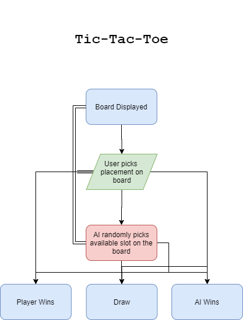

# TicTacToe-Java
Tic-Tac-Toe project for Computer Science A, using a 2D char array to form a Player Vs. AI Tic Tac Toe. The AI is randomized using the java random utility, and is ensured to not repeat using conditionals and for loops.

<h1>Acknowledgement</h1>
<b>Logan Gosch:</b> https://github.com/logan-gosch  
